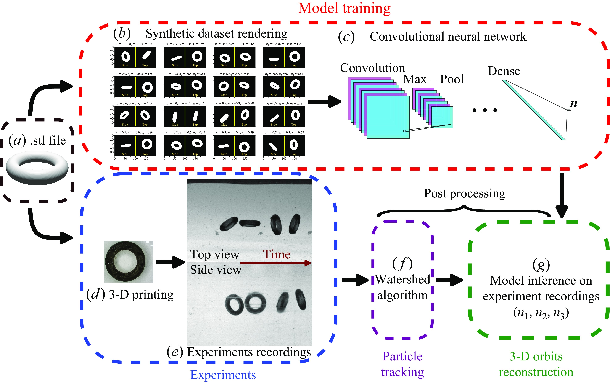
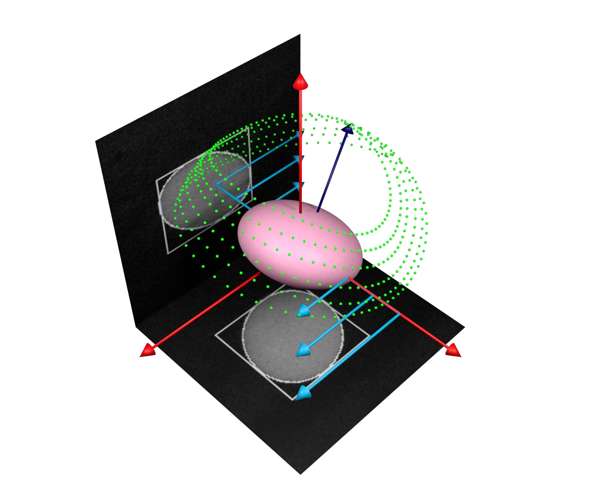
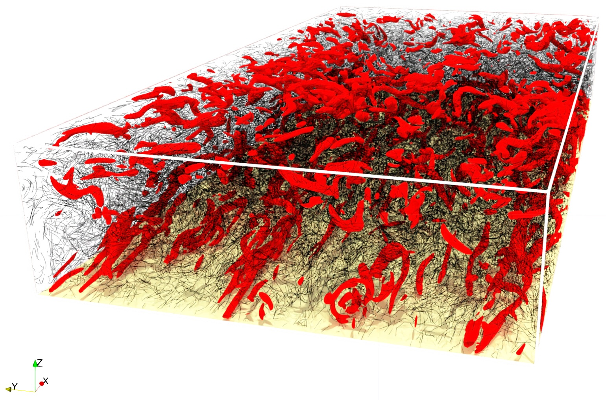

# Publications

 

## 2025

### Orientation of flat bodies of revolution in shear flows at low Reynolds number
{: width="150px" align="left" }

**Authors:** **Di Giusto, D.**, Bergougnoux, L. and Guazzelli, É.

**Journal:** Journal of Fluid Mechanics, 1017, p.A41.

[📄 PDF](https://www.cambridge.org/core/services/aop-cambridge-core/content/view/B66C5D71373A2DF5199B3AA399AE78C7/S0022112025104217a.pdf/orientation-of-flat-bodies-of-revolution-in-shear-flows-at-low-reynolds-number.pdf)

 

## 2024

### Influence of small inertia on Jeffery orbits
{: width="150px" align="left" }

**Authors:** **Di Giusto, D.**, Bergougnoux, L., Marchioli, C. and Guazzelli, É.

**Journal:** Journal of Fluid Mechanics, 979, p.A42. 

[📄 PDF](https://hal.science/hal-04492675/document) 

 

## 2022

### Turbulence modulation by slender fibers
{: width="150px" align="left" }

**Authors:** **Di Giusto, D.** and Marchioli, C.

**Journal:** Fluids, 7(8), p.255. 

[📄 PDF](https://www.mdpi.com/2311-5521/7/8/255) 
